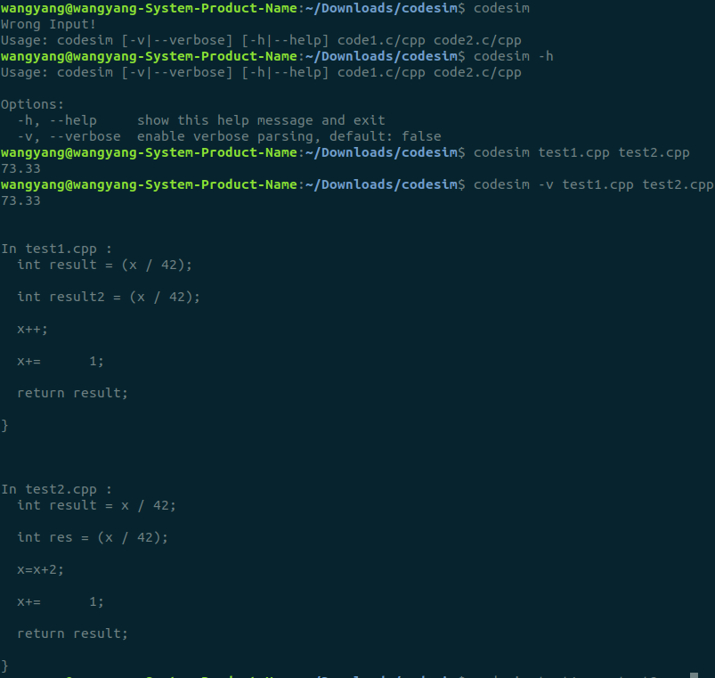

### [PA1] 代码相似度度量

#### 1 综述

本次实验先对C/C++代码code<sub>1</sub>和code<sub>2</sub>对进行预处理，然后使用clang6.0的python接口生成其AST，遍历AST提取节点信息将代码序列化，求其再根据其最长公共子串和第二长公共子串比较其相似性，最终实现了linux下较为用户友好的命令行工具codesim。接下来展示实现细节。

#### 2 实现细节

##### 2.1 预处理

因为clang具有强大的C/C++代码解析功能，所以预处理仅仅去除了头文件，空行以及单行注释，预处理后的代码code<sub>1</sub>‘和code<sub>2</sub>’保存在tempfile包的mkdtemp()函数生成的临时路径中。

```python
def format(str):
	line = str.strip()
    deleteflag = False
	if line == "" or line.startswith("//") or line.startswith("#include"):
		deleteflag = True
	return line,deleteflag
```

##### 2.2 生成AST

将clang中的 /usr/lib/llvm-6.0/lib/ libclang-6.0.so.1文件单独拷贝出来，供python调用。

```python
from clang.cindex import Config
from optparse import OptionParser
Config.set_library_file("libclang-6.0.so.1")

index = clang.cindex.Index.create()
tu1 = index.parse(file1)
tu2 = index.parse(file2)
```

##### 2.3 遍历AST 

前序遍历AST，用两个list结构分别保留每个node对应预处理后文件中的位置信息以及节点类型。其中位置信息用于在verbose模式下定位可疑代码行，节点类型hash成一个整数，就得到序列化的代码l<sub>1</sub>和l<sub>2</sub>。

```python
def traverse(node,code_sequence,hashtable,position):
    for child in node.get_children():
    	position.append(node.location.line)
    	code_sequence.append(hashtable.index(node.kind))
    	traverse(child,code_sequence,hashtable,position)
```

##### 2.4 LCS

得到l<sub>1</sub>和l<sub>2</sub>后，先求得最长公共子串lcs，然后分别用l<sub>1</sub>和l<sub>2</sub>截掉lcs得到lcs之前的序列l<sub>3</sub>和l<sub>5</sub>和lcs之后的序列l<sub>4</sub>和l<sub>6</sub>，再取l<sub>3</sub>和l<sub>5</sub>，l<sub>3</sub>和l<sub>6</sub>，l<sub>4</sub>和l<sub>5</sub>，l<sub>4</sub>和l<sub>6</sub>的最长公共子串，将其中长度最长的作为l<sub>1</sub>和l<sub>2</sub>的次最长公共子串lcs‘，然后计算相似性。
$$
sim=\frac{|lcs|+|lcs'|}{min(|l_1|,|l_2|)}
$$

```python
def LCS(s1,s2,maxlen):
	l1 = len(s1)
	l2 = len(s2)
	match = []
	if l1 == 0 or l2 == 0:
		return match
	for i in range(l1):
		for j in range(l2):
			k = 0
			while i+k < l1 and j+k <l2 and s1[i+k]>0 and s2[j+k]>0 and s1[i+k]==s2[j+k]:
				k=k+1
			if k > maxlen:
				match = [[k,i,j]]
				maxlen = k
			elif k == maxlen:
				match.append([k,i,j])
	return match
```

##### 2.5 verbose

如作业要求，利用optparse包控制参数输入，可以输入-h/--help查看帮助信息，加入-v/--verbose参数可以输出可疑代码。

#### 3 编译方法

在linux下，进入codesim文件夹，在有python3以及pip3的前提下运行如下命令（中途需要输一次密码），即可使用命令行工具codesim。

```python
python3 setup.py
```



